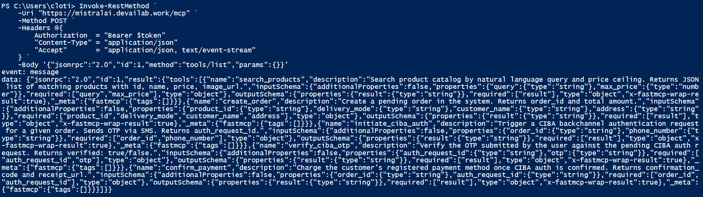

# Agentic AI Takes Over Commerce

What if buying anything was as simple as asking? Why juggle multiple apps like it’s 2015, when your assistant can do it all in one conversation?

- 🚗 Book the cheapest Uber or Lyft—right inside **ChatGPT** - https://www.youtube.com/shorts/5ZI7IgvJHV8
- 💐 Send flowers instantly from your local nearby store inside **Mistral AI Le Chat** - https://youtu.be/671YMGWVHL0
- 🍔 Order your favorite nearby burgers with **Anthropic Claude** - https://www.youtube.com/shorts/Cy-N7jy_BsQ

#### Try it out here - https://hackaton.devailab.work/mcp

How to set ip up into your fa

## The Vision

Meet **Agentic Commerce Protocol** — the **end of apps**, **tabs**, and **checkout flows**. **Just intent**.

Tell your favorite AI assistant **what you want**, and **it acts**. It **finds** products, **compares** options, **negotiates** prices, and **completes** the purchase — instantly. **No redirects**. **No forms**. **No friction**.

Powered by a secure, **OAuth-protected MCP server**, our platform turns any AI assistant into a fully autonomous buyer. It can discover products, execute transactions, and handle payments end-to-end through a trusted, standardized protocol.

This isn’t another marketplace. It’s a new interface for commerce.

Why juggle multiple apps like it’s 2015, when your assistant can do it all in one conversation?

With Agentic Commerce, intent becomes action.

Search becomes obsolete. Browsing becomes optional.
Transactions become invisible.

We’re not improving e-commerce — we’re replacing it.

Welcome to a world where AI doesn’t just assist.
It decides, negotiates, and buys for you.

**What if you could place your order directly with Mistral AI Le Chat using the Agentic Commerce Protocol?**

Just tell Le Chat what you want — and it orders, negotiates, and pays for you. We implement a secure, OAuth-protected MCP server that enables Mistral AI Le Chat to discover products, execute commerce tools, and complete end-to-end Agentic Commerce transactions through a standardized and trusted protocol.

You can try the Commerce Protocol out here - https://mistralai.devailab.work/mcp. 

We implemented a secure, **OAuth-protected MCP server** that enables **Mistral AI Le Chat** to **discover products**, **execute commerce tools**, and **complete end-to-end Agentic Commerce transactions** through a **standardized** and **trusted protocol**.

[](https://youtu.be/2RNwvZ_C-78)

### Commerce Protocol
We implement an AI agent that enables users to discover products, negotiate, order, and pay within a standardized and seamless commerce flow.

### Secure Server Exposure
Le Chat connects to our OAuth-protected MCP server using **discovery Dynamic Client Registration (DCR)**, and a **PKCE Authorization Code flow** with **Auth0**. It obtains a **signed JWT access token**, verified via **JWKS** before **granting MCP-based MCP tool execution** with automatic token refresh.

### Capabilities
Secure **product discovery**, **contextual ordering**, **real-time negotiation**, **payment initiation** via CIBA, and persistent user context — enabling end-to-end trusted Agentic Commerce.

### First - you need to make it available - here https://chat.mistral.ai/connections


### Second - you need to create an Auth0 account


# OAuth 2.1 - Secure Server Exposure

```
agentic-commerce/
├── app.py
└── mcp_auth/
    ├── __init__.py
    ├── config.py
    ├── token.py
    ├── middleware.py
    └── routes.py
```

# Capabilities

```
agentic-commerce/
├── app.py
└── mcp_auth/
    ├── __init__.py
    ├── data.py
    ├── filters.py
    ├── handlers.py
    ├── models.py
    ├── server.py
    └── widgets.py
```

# How to get access?

### Step 1 - get a token the same way Le Chat does (auth code flow uses same token endpoint)
Get a fresh token
```shell
$body = @{
    client_id     = "xxx"
    client_secret = "xxx"
    audience      = "https://mistralai.devailab.work/mcp"
    grant_type    = "client_credentials"
} | ConvertTo-Json

$response = Invoke-RestMethod `
    -Uri "https://dev-rcc43qlv8opam0co.us.auth0.com/oauth/token" `
    -Method POST `
    -ContentType "application/json" `
    -Body $body

$token = $response.access_token
Write-Host "Token starts with: $($token.Substring(0, 20))"
Write-Host "Segment count: $(($token -split '\.').Count)"
```

### Step 2 - test it against your server

```shell
$result = Invoke-RestMethod `
    -Uri "https://mistralai.devailab.work/debug-token" `
    -Method POST `
    -Headers @{ Authorization = "Bearer $token" }

$result | ConvertTo-Json
```

The output: 

```shell
{
    "raw_token_length":  750,
    "raw_token_head":  "eyJhb...",
    "raw_token_tail":  "nHmHKGOI857OxBa9DWOg",
    "segment_count":  3,
    "header":  {
                   "alg":  "RS256",
                   "typ":  "JWT",
                   "kid":  "9-d79AyjEB4F_0mzAy9wX"
               },
    "payload":  {
                    "iss":  "https://dev-rcc43qlv8opam0co.us.auth0.com/",
                    "sub":  "xxx@clients",
                    "aud":  "https://mistralai.devailab.work/mcp",
                    "iat":  1772384562,
                    "exp":  1772470962,
                    "gty":  "client-credentials",
                    "azp":  "xxx"
                }
}
```

```shell
Invoke-RestMethod `
    -Uri "https://mistralai.devailab.work/mcp" `
    -Method POST `
    -Headers @{
        Authorization  = "Bearer $token"
        "Content-Type" = "application/json"
        "Accept"       = "application/json, text/event-stream"
    } `
    -Body '{"jsonrpc":"2.0","id":1,"method":"tools/list","params":{}}'
```


