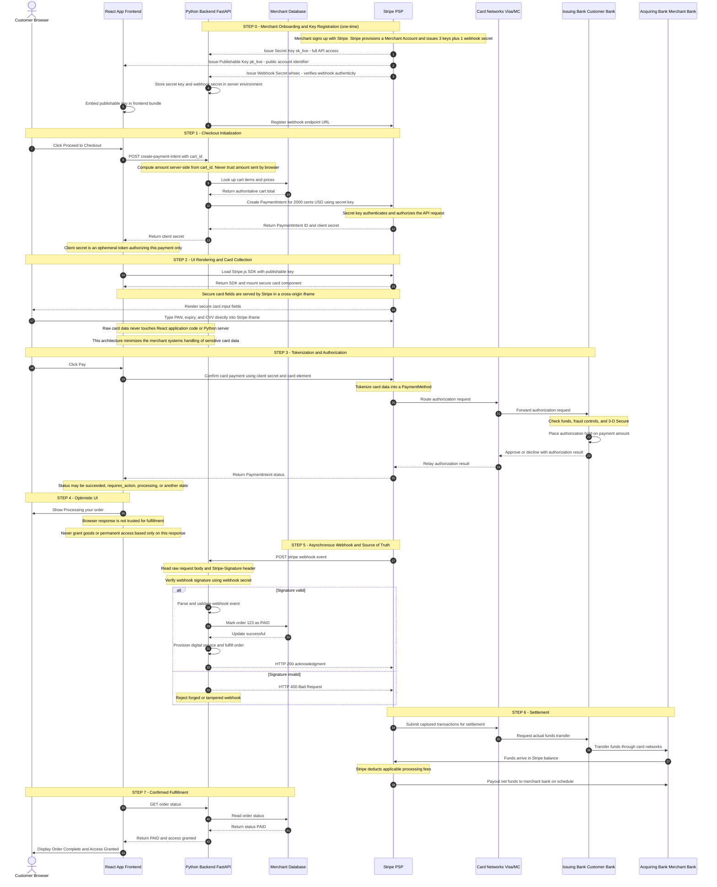

```mermaid
sequenceDiagram
    autonumber
    actor Customer as Customer Browser
    participant React as React App Frontend
    participant Python as Python Backend FastAPI
    participant DB as Merchant Database
    participant PSP as Stripe PSP
    participant Networks as Card Networks Visa/MC
    participant IssuingBank as Issuing Bank Customer Bank
    participant AcquiringBank as Acquiring Bank Merchant Bank

    Note over Python,PSP: STEP 0 - Merchant Onboarding and Key Registration (one-time)
    Note over PSP: Merchant signs up with Stripe. Stripe provisions a Merchant Account and issues 3 keys plus 1 webhook secret
    PSP-->>Python: Issue Secret Key sk_live - full API access
    PSP-->>React: Issue Publishable Key pk_live - public account identifier
    PSP-->>Python: Issue Webhook Secret whsec - verifies webhook authenticity
    Python->>Python: Store secret key and webhook secret in server environment
    React->>React: Embed publishable key in frontend bundle
    Python->>PSP: Register webhook endpoint URL

    Note over Customer,PSP: STEP 1 - Checkout Initialization
    Customer->>React: Click Proceed to Checkout
    React->>Python: POST create-payment-intent with cart_id
    Note over Python: Compute amount server-side from cart_id. Never trust amount sent by browser
    Python->>DB: Look up cart items and prices
    DB-->>Python: Return authoritative cart total
    Python->>PSP: Create PaymentIntent for 2000 cents USD using secret key
    Note over PSP: Secret key authenticates and authorizes the API request
    PSP-->>Python: Return PaymentIntent ID and client secret
    Python-->>React: Return client secret
    Note over React: Client secret is an ephemeral token authorizing this payment only

    Note over Customer,PSP: STEP 2 - UI Rendering and Card Collection
    React->>PSP: Load Stripe.js SDK with publishable key
    PSP-->>React: Return SDK and mount secure card component
    Note over React,PSP: Secure card fields are served by Stripe in a cross-origin iframe
    PSP-->>Customer: Render secure card input fields
    Customer->>PSP: Type PAN, expiry, and CVV directly into Stripe iframe
    Note over React,Python: Raw card data never touches React application code or Python server
    Note over React,Python: This architecture minimizes the merchant systems handling of sensitive card data

    Note over Customer,IssuingBank: STEP 3 - Tokenization and Authorization
    Customer->>React: Click Pay
    React->>PSP: Confirm card payment using client secret and card element
    Note over PSP: Tokenize card data into a PaymentMethod
    PSP->>Networks: Route authorization request
    Networks->>IssuingBank: Forward authorization request
    Note over IssuingBank: Check funds, fraud controls, and 3-D Secure
    IssuingBank->>IssuingBank: Place authorization hold on payment amount
    IssuingBank-->>Networks: Approve or decline with authorization result
    Networks-->>PSP: Relay authorization result
    PSP-->>React: Return PaymentIntent status
    Note over React: Status may be succeeded, requires_action, processing, or another state

    Note over React,Customer: STEP 4 - Optimistic UI
    React->>Customer: Show Processing your order
    Note over React: Browser response is not trusted for fulfillment
    Note over React: Never grant goods or permanent access based only on this response

    Note over PSP,DB: STEP 5 - Asynchronous Webhook and Source of Truth
    PSP->>Python: POST stripe webhook event
    Note over Python: Read raw request body and Stripe-Signature header
    Note over Python: Verify webhook signature using webhook secret
    alt Signature valid
        Python->>Python: Parse and validate webhook event
        Python->>DB: Mark order 123 as PAID
        DB-->>Python: Update successful
        Python->>Python: Provision digital service and fulfill order
        Python-->>PSP: HTTP 200 acknowledgment
    else Signature invalid
        Python-->>PSP: HTTP 400 Bad Request
        Note over Python: Reject forged or tampered webhook
    end

    Note over PSP,AcquiringBank: STEP 6 - Settlement
    PSP->>Networks: Submit captured transactions for settlement
    Networks->>IssuingBank: Request actual funds transfer
    IssuingBank->>AcquiringBank: Transfer funds through card networks
    AcquiringBank->>PSP: Funds arrive in Stripe balance
    Note over PSP: Stripe deducts applicable processing fees
    PSP->>AcquiringBank: Payout net funds to merchant bank on schedule

    Note over Customer,DB: STEP 7 - Confirmed Fulfillment
    React->>Python: GET order status
    Python->>DB: Read order status
    DB-->>Python: Return status PAID
    Python-->>React: Return PAID and access granted
    React->>Customer: Display Order Complete and Access Granted
```
```
