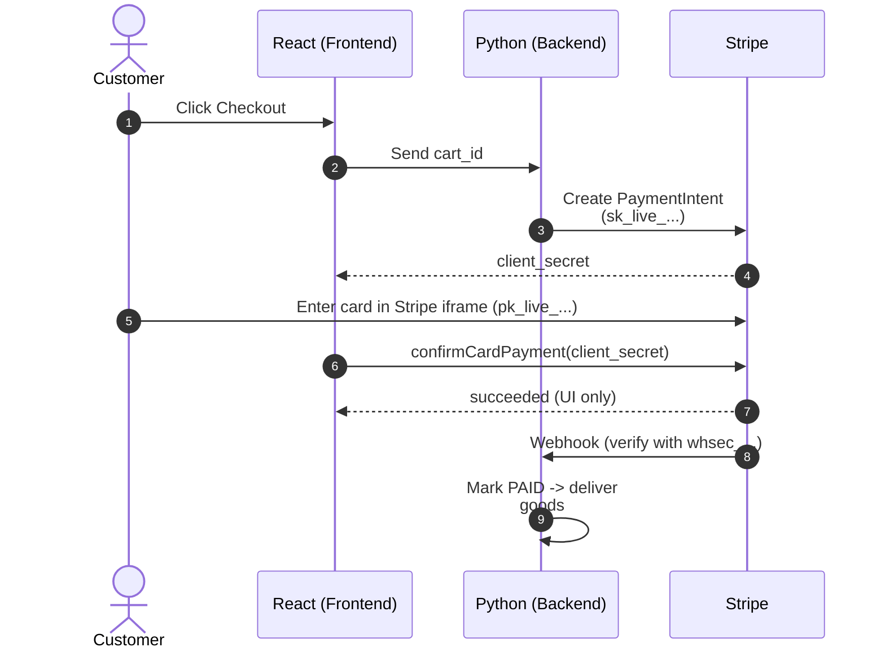
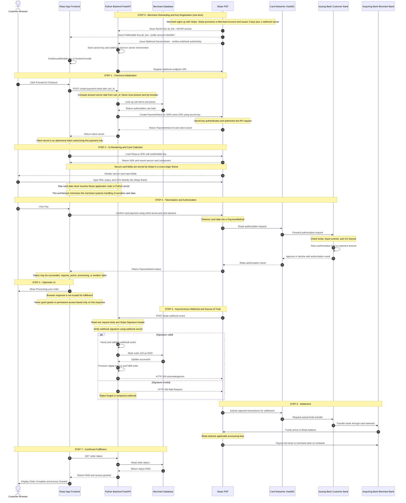

# How a Card Payment Moves Through React, Python, and Stripe

Server-Side PaymentIntent, Client-Side Card Collection, Webhook-Verified Fulfillment



- Create **<mark>PaymentIntent</mark>** (`sk_live_...`): Our backend tells Stripe "I want to collect $20 from a customer — set up a payment slot for it." A `PaymentIntent` is Stripe's record of one attempted payment: the amount, the currency, and its status (pending → succeeded). Our backend creates it before the customer pays so the amount is **locked server-side** and can't be tampered with. The `sk_live_...` is **our backend's password to Stripe**. It **proves the request** is really from you.

- The **<mark>client_secret</mark>**: When Stripe creates the `PaymentIntent`, it returns a `client_secret` — a one-time password tied to that specific $20 payment. Think of it as a **claim ticket**. Our backend can't safely hand the browser the secret key (that would give the browser full account power). So instead Stripe issues a **narrow**, **single-use ticket** that says: "the holder of this ticket is allowed to complete this one $20 payment — and nothing else." The browser needs some permission to finish the payment. The client_secret is exactly that permission, **scoped to one transaction**.

- **<mark>Stripe iframe (pk_live_...)</mark>**: The `pk_live_...` (**publishable key**) just tells Stripe **which merchant account the card fields belong to**. It's public and powerless on its own — it can't move money. The key is only there so Stripe knows it's your account.

- "confirmCardPayment(client_secret)". This is the moment the browser says to Stripe: "here's the ticket for the $20 payment — go charge the card I just collected." It hands back the client_secret (the ticket) so Stripe can match the card the customer typed to the exact $20 payment your backend set up earlier. Stripe then contacts the banks and charges it. Plain version: "Browser tells Stripe: use this ticket, charge the card now."

### Step 0 — Merchant Onboarding & Key Registration
- The merchant registers with Stripe once.
- Stripe creates a **merchant account** (where funds will be held) and issues the **three keys**.
- **Secret** and **webhook keys** are stored in **server environment variables**, never sent to the browser.
- The **publishable key** is compiled into the frontend.
- The merchant also registers the **URL** where **Stripe should later send webhooks**.

    - **<mark>Publishable Key</mark>** (`pk_live_`...) — **Public identifier**. **Lives in the browser**. Tells Stripe "which merchant account this frontend belongs to." Can only create tokens and mount UI. Useless to an attacker because it cannot move money or read data.
    - **<mark>Secret Key</mark>** (`sk_live_`...) — **Private credential**. Lives only on the backend. Proves to Stripe that a server request genuinely comes from the account owner. Authorizes money-moving actions (charge, capture, refund). If leaked, an attacker controls the account.
    - **<mark>Webhook Secret</mark>** (`whsec_`...) — **Shared signing key**. Lives only on the backend. Used to verify that an incoming webhook was actually sent by Stripe and not forged. It does not encrypt; it authenticates the message origin. The browser gets a key that can only identify; the server gets keys that can authorize and verify.

### Step 1 — Checkout Initialization

The customer clicks checkout. React asks the backend to start a payment, sending only a cart identifier — not a price. The backend looks up the real price in its own database, then calls Stripe using the secret key to create a PaymentIntent (a Stripe object representing "an attempt to collect a specific amount"). Stripe returns a client_secret.

Purpose: the amount is calculated server-side so the customer cannot tamper with it. The secret key authenticates the merchant to Stripe. The client_secret is a single-use token authorizing the browser to complete only this one payment.

### Step 2 — UI Rendering & Card Collection

- React loads **Stripe.js** using the **publishable key** and mounts an **iframe served by Stripe**.
- The card fields live inside this iframe. Because the iframe is a different origin, the merchant's own JavaScript cannot read what the customer types.

Purpose: **raw card numbers never enter merchant code or servers**. This keeps the merchant out of the strictest PCI-DSS compliance scope. Stripe, not the merchant, is the party that touches the card data.

### Step 3 — Tokenization & Authorization

- The customer clicks Pay.
- React calls confirmCardPayment with the client_secret.
- Stripe reads the card data from its own iframe, converts the raw card number into a token (a PaymentMethod ID like pm_...), and stores the real number in its vault. Stripe then routes an authorization request through the card networks to the customer's issuing bank. The bank checks funds, runs fraud/3-D Secure, and places a hold. Approval flows back to Stripe, which reports succeeded to the browser.

Purpose: tokenization replaces the sensitive number with a safe reference. Authorization confirms the bank will release the funds and reserves them, but has not yet transferred them.

### Step 4 — Optimistic UI

React shows "Processing your order." This is only a visual update.

Purpose: give the user feedback. This browser response is not trusted for delivering goods, because browser code can be modified by the user to fake a success.

### Step 5 — Asynchronous Webhook (Source of Truth)

Stripe independently sends a server-to-server POST to the backend's registered URL, reporting payment_intent.succeeded. The backend recomputes an HMAC signature over the raw request body using the webhook secret and compares it to the signature Stripe attached. If they match, the event is genuine: the backend marks the order paid and provisions the service. If they don't match, the event is rejected as forged.

Purpose: this is the authoritative confirmation that money actually moved. It comes directly from Stripe (not through the manipulable browser) and is cryptographically verified. Fulfillment happens here, not in Step 4.

### Step 6 — Settlement

Later, in batches, Stripe submits the authorized transactions for actual fund movement. The issuing bank transfers money through the card networks to the acquiring bank (the merchant's bank side). Funds land in the Stripe balance, Stripe deducts fees, and pays out the net amount to the merchant's bank on a schedule.

Purpose: authorization (Step 3) only reserved the funds; settlement is when the money is truly captured and moved. This is asynchronous and can take days.

### Step 7 — Confirmed Fulfillment

React asks the backend for the final order status (by polling or a pushed update). The backend reads the database — already marked PAID in Step 5 — and returns confirmation. React displays "Order Complete & Access Granted."

Purpose: the frontend reflects the state the backend has already authoritatively confirmed, closing the loop between the trusted server state and the user's screen.

The Actors (Gateway / Processor / PSP)

With Stripe these are one vendor wearing three hats. Gateway: the iframe that captures and encrypts card data (Step 2–3). Processor: Stripe routing the transaction through card networks and banks (Step 3, 6). PSP: Stripe as the company bundling both and providing the merchant account that holds funds (Step 0, 6). You integrate once; Stripe fulfills all three roles internally.


```
