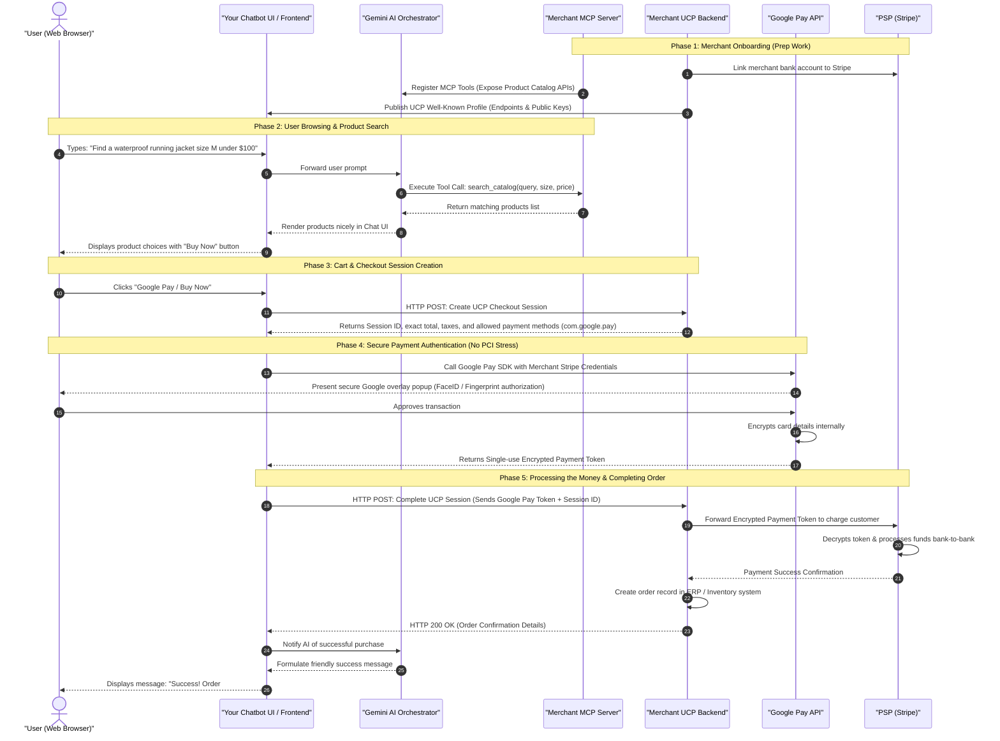
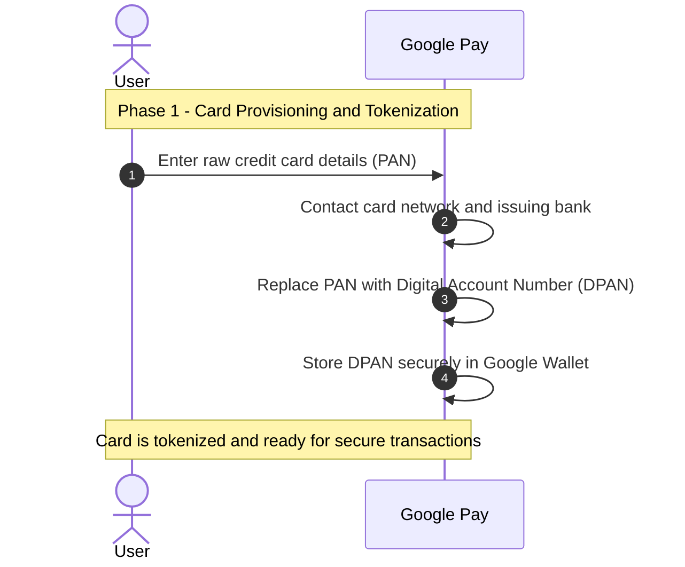
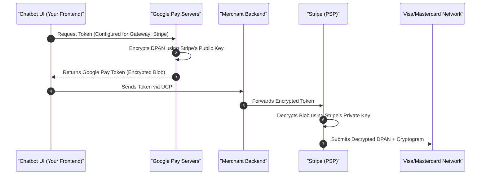

```mermaid
sequenceDiagram
    autonumber
    actor User as "User (Web Browser)"
    participant BotUI as "Your Chatbot UI / Frontend"
    participant Gemini as "Gemini AI Orchestrator"
    participant MerchMCP as "Merchant MCP Server"
    participant MerchUCP as "Merchant UCP Backend"
    participant GPay as "Google Pay API"
    participant Stripe as "PSP (Stripe)"

    %% PHASE 1: MERCHANDISER ONBOARDING
    Note over MerchMCP, Stripe: Phase 1: Merchant Onboarding (Prep Work)
    MerchUCP->>Stripe: Link merchant bank account to Stripe
    MerchMCP->>Gemini: Register MCP Tools (Expose Product Catalog APIs)
    MerchUCP->>BotUI: Publish UCP Well-Known Profile (Endpoints & Public Keys)

    %% PHASE 2: BROWSING & SEARCH
    Note over User, MerchMCP: Phase 2: User Browsing & Product Search
    User->>BotUI: Types: "Find a waterproof running jacket size M under $100"
    BotUI->>Gemini: Forward user prompt
    Gemini->>MerchMCP: Execute Tool Call: search_catalog(query, size, price)
    MerchMCP-->>Gemini: Return matching products list
    Gemini-->>BotUI: Render products nicely in Chat UI
    BotUI-->>User: Displays product choices with "Buy Now" button

    %% PHASE 3: CHECKOUT INITIALIZATION
    Note over User, MerchUCP: Phase 3: Cart & Checkout Session Creation
    User->>BotUI: Clicks "Google Pay / Buy Now"
    BotUI->>MerchUCP: HTTP POST: Create UCP Checkout Session
    MerchUCP-->>BotUI: Returns Session ID, exact total, taxes, and allowed payment methods (com.google.pay)

    %% PHASE 4: GOOGLE PAY TOKENIZATION
    Note over User, GPay: Phase 4: Secure Payment Authentication (No PCI Stress)
    BotUI->>GPay: Call Google Pay SDK with Merchant Stripe Credentials
    GPay-->>User: Present secure Google overlay popup (FaceID / Fingerprint authorization)
    User->>GPay: Approves transaction
    GPay->>GPay: Encrypts card details internally
    GPay-->>BotUI: Returns Single-use Encrypted Payment Token

    %% PHASE 5: TRANSACTION COMPLETION
    Note over BotUI, Stripe: Phase 5: Processing the Money & Completing Order
    BotUI->>MerchUCP: HTTP POST: Complete UCP Session (Sends Google Pay Token + Session ID)
    MerchUCP->>Stripe: Forward Encrypted Payment Token to charge customer
    Stripe->>Stripe: Decrypts token & processes funds bank-to-bank
    Stripe-->>MerchUCP: Payment Success Confirmation
    MerchUCP->>MerchUCP: Create order record in ERP / Inventory system
    MerchUCP-->>BotUI: HTTP 200 OK (Order Confirmation Details)
    BotUI->>Gemini: Notify AI of successful purchase
    Gemini-->>BotUI: Formulate friendly success message
    BotUI-->>User: Displays message: "Success! Order #12345 has been placed."
```

How credit cards are secured in Google Pay and how Stripe processes that token without anyone seeing the raw card details

### Step 1: How a Card Gets into Google Pay (Network Tokenization)

When a user adds a credit card to Google Pay, the **raw card number** (**PAN - Primary Account Number**) is destroyed almost immediately and replaced using a process called <mark>**Network Tokenization**</mark>.

- <mark>**The Handshake**</mark>: The user types their **16-digit card number (PAN)** into the Google Pay app. Google Pay securely transmits this data directly to the **Card Network** (Visa, Mastercard, Amex).
- <mark>**The Substitution**</mark>: The **Card Network** asks the **Issuing Bank** (the bank that gave the user the card) for a **substitute number**. This substitute is called a **DPAN (Digital Primary Account Number)** or a <mark>**Network Token**</mark>.
- <mark>**The Storage**</mark>: The raw card number is discarded by Google. Only the **DPAN** is stored securely in Google's encrypted servers. This DPAN is entirely useless outside of the Google Pay ecosystem; if a hacker steals it, they cannot use it to buy things on Amazon or swipe it at a physical grocery store.

```mermaid
sequenceDiagram
    autonumber
    actor User
    participant GPay as Google Pay

    Note over User,GPay: Phase 1 - Card Provisioning and Tokenization
    User->>GPay: Enter raw credit card details (PAN)
    GPay->>GPay: Contact card network and issuing bank
    GPay->>GPay: Replace PAN with Digital Account Number (DPAN)
    GPay->>GPay: Store DPAN securely in Google Wallet
    Note over User,GPay: Card is tokenized and ready for secure transactions
```

### Part 2: How Stripe Recognizes the Google Pay Token

How Stripe does understand a token generated by Google? 
This works because of a **pre-established cryptographic framework** and a **joint configuration** called <mark>**Gateway Tokenization**</mark>.
Before a transaction ever happens, **the merchant configures their frontend Google Pay SDK** with a specific parameter: `gateway: 'stripe'`.

The Cryptographic Chain of Custody:

```mermaid
sequenceDiagram
    autonumber
    participant BotUI as "Chatbot UI (Your Frontend)"
    participant GPay as "Google Pay Servers"
    participant Merch as "Merchant Backend"
    participant Stripe as "Stripe (PSP)"
    participant Network as "Visa/Mastercard Network"

    BotUI->>GPay: Request Token (Configured for Gateway: Stripe)
    GPay->>GPay: Encrypts DPAN using Stripe's Public Key
    GPay-->>BotUI: Returns Google Pay Token (Encrypted Blob)
    BotUI->>Merch: Sends Token via UCP
    Merch->>Stripe: Forwards Encrypted Token
    Stripe->>Stripe: Decrypts Blob using Stripe's Private Key
    Stripe->>Network: Submits Decrypted DPAN + Cryptogram
```

1. <mark>**The Shared Keys**</mark>: Stripe and Google Pay have an ongoing platform agreement. Google Pay holds Stripe’s Public Cryptographic Keys in its master system.
2. <mark>**The Target Lock**</mark>: When our Chatbot UI calls the Google Pay API, it explicitly says: "Hey Google, I am requesting a token for a merchant who uses Stripe."
3. <mark>**The Encryption**</mark>: Google Pay takes the **stored secure card details (DPAN)** and packs it inside an **encrypted payload** (a **JSON cryptographic blob**) using **Stripe’s public key**.
4. <mark>**The Blind Hand-off**</mark>: Google Pay hands this **encrypted blob to our Chatbot UI**. Our frontend, our backend, and the merchant's MCP server can all look at this payload, but it looks like **unreadable gibberish**. This is why you don't need PCI compliance; you lack the mathematical key required to read it.
5. <mark>**The Decryption**</mark>: The merchant backend passes this unreadable blob to Stripe via the Stripe API. Because the blob was encrypted with Stripe's public key, only Stripe's matching Private Key can unlock it.
6. <mark>**The Charge**</mark>: Stripe **decrypts the blob**, **extracts the DPAN** along with a **one-time cryptographic signature** (**cryptogram**), and **forwards** it directly to the **Visa/Mastercard networks** to legally pull the funds from the user's bank.

#### Summary of Concepts
- <mark>**Network Token (DPAN)**</mark>: A permanent fake card number issued by the card network that replaces the real card inside Google's wallet.
- <mark>**Gateway Token (The Blob)**</mark>: A single-use, highly encrypted package containing the DPAN, wrapped by Google using Stripe's public key so that only Stripe can read it.
- <mark>**Asymmetric Encryption**</mark>: The mathematical concept (Public/Private key pairs) that ensures sensitive data can pass through unsafe intermediaries (our chatbot, the UCP backend) without being compromised.

