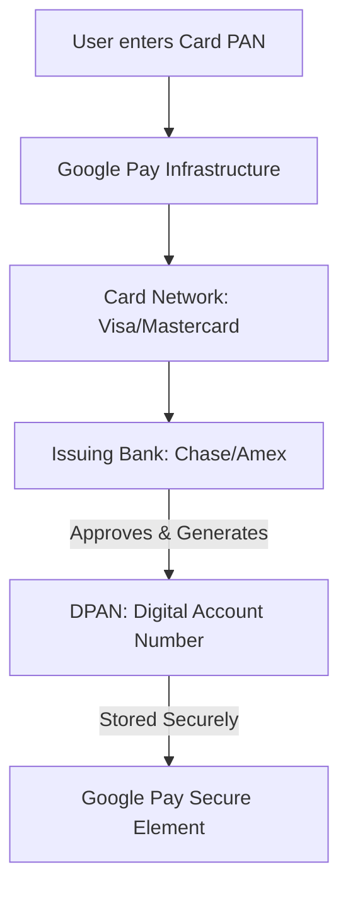

```mermaid
graph TD
    User[User enters Card PAN] --> GPay[Google Pay Infrastructure]
    GPay --> Network[Card Network: Visa/Mastercard]
    Network --> Issuer[Issuing Bank: Chase/Amex]
    Issuer -->|Approves & Generates| Token[DPAN: Digital Account Number]
    Token -->|Stored Securely| GPaySecure[Google Pay Secure Element]
```
