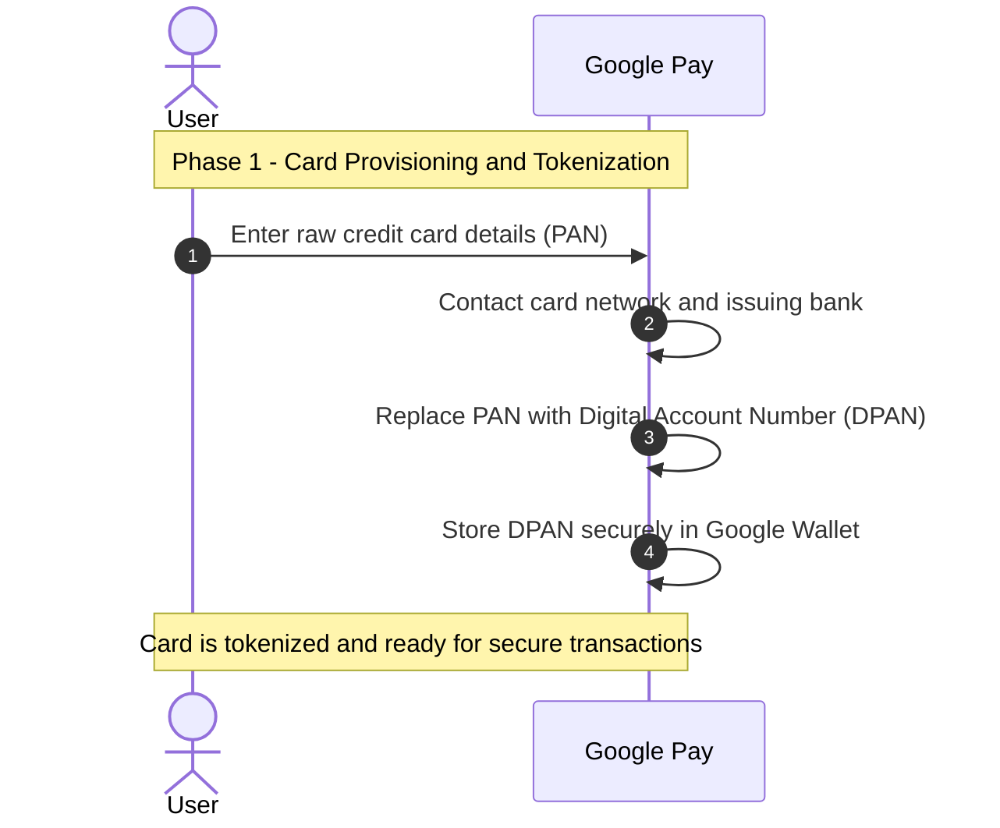

How credit cards are secured in Google Pay and how Stripe processes that token without anyone seeing the raw card details

### Step 1: How a Card Gets into Google Pay (Network Tokenization)

When a user adds a credit card to Google Pay, the **raw card number** (**PAN - Primary Account Number**) is destroyed almost immediately and replaced using a process called <mark>**Network Tokenization**</mark>.

- <mark>**The Handshake**</mark>: The user types their **16-digit card number (PAN)** into the Google Pay app. Google Pay securely transmits this data directly to the **Card Network** (Visa, Mastercard, Amex).
- <mark>**The Substitution**</mark>: The **Card Network** asks the **Issuing Bank** (the bank that gave the user the card) for a **substitute number**. This substitute is called a **DPAN (Digital Primary Account Number)** or a <mark>**Network Token**</mark>.
- <mark>**The Storage**</mark>: The raw card number is discarded by Google. Only the **DPAN** is stored securely in Google's encrypted servers. This DPAN is entirely useless outside of the Google Pay ecosystem; if a hacker steals it, they cannot use it to buy things on Amazon or swipe it at a physical grocery store.

```mermaid
sequenceDiagram
    autonumber
    actor User
    participant GPay as Google Pay

    Note over User,GPay: Phase 1 - Card Provisioning and Tokenization
    User->>GPay: Enter raw credit card details (PAN)
    GPay->>GPay: Contact card network and issuing bank
    GPay->>GPay: Replace PAN with Digital Account Number (DPAN)
    GPay->>GPay: Store DPAN securely in Google Wallet
    Note over User,GPay: Card is tokenized and ready for secure transactions
```

### Part 2: How Stripe Recognizes the Google Pay Token

How Stripe does understand a token generated by Google? 
This works because of a **pre-established cryptographic framework** and a **joint configuration** called <mark>**Gateway Tokenization**</mark>.
Before a transaction ever happens, **the merchant configures their frontend Google Pay SDK** with a specific parameter: `gateway: 'stripe'`.

The Cryptographic Chain of Custody:

