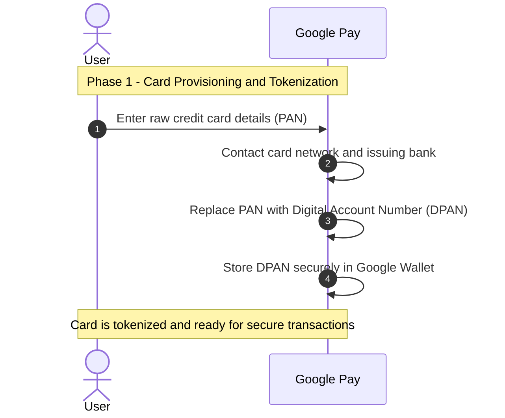

```mermaid
sequenceDiagram
    autonumber
    actor User
    participant GPay as Google Pay

    Note over User,GPay: Phase 1 - Card Provisioning and Tokenization
    User->>GPay: Enter raw credit card details (PAN)
    GPay->>GPay: Contact card network and issuing bank
    GPay->>GPay: Replace PAN with Digital Account Number (DPAN)
    GPay->>GPay: Store DPAN securely in Google Wallet
    Note over User,GPay: Card is tokenized and ready for secure transactions
```

